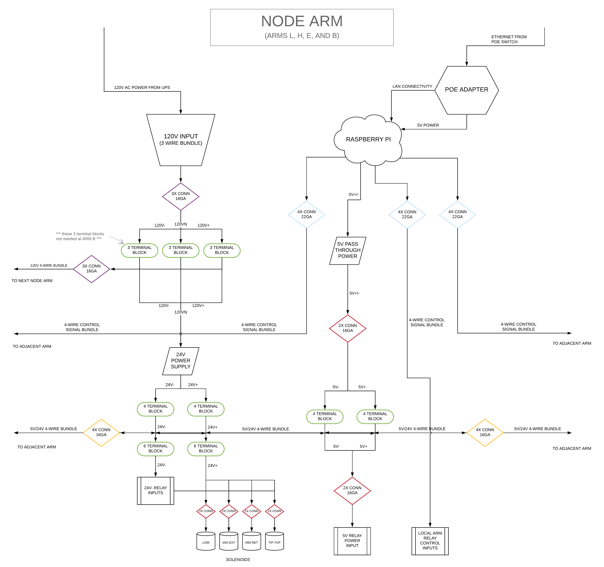

# murmur

## dependencies
#### *pyyaml*
```
sudo pip3 install pyyaml
```

#### *gpiozero*
```
sudo apt-get update
sudo apt-get install python3-gpiozero
```

#### *relay repo is a submodule*
[link to the repo](https://github.com/barlaensdoonn/relay)

## connections


#### *denkovi 5V 4-channel relay board*
[link to the board](http://denkovi.com/relay-module-5v-4-channels-for-raspberry-pi-arduino-pic-avr)
```
raspi connections to relay board:
    5V -> VCC
    GND -> GND
    GPIO -> IN*

power supply connections to relay terminals:
    +V 24V power supply -> +V actuator power input
    GND 24V power supply -> NC relay terminal -> GND actuator power input
```

## signal flow


